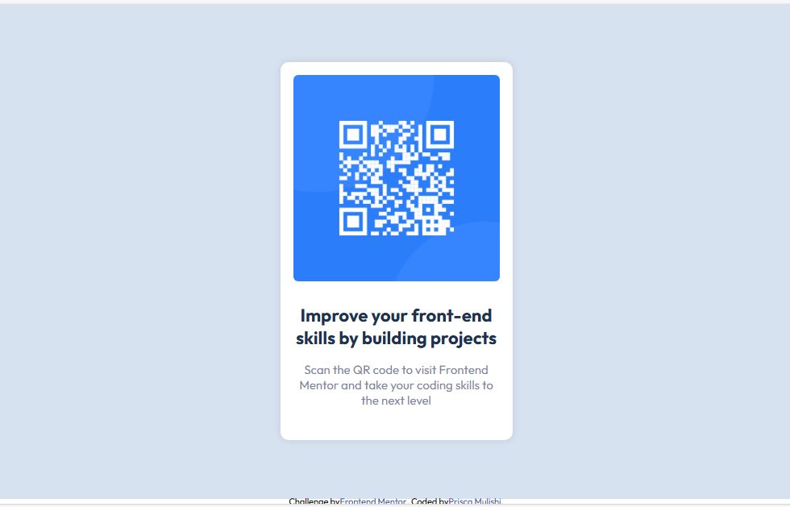

# Frontend Mentor - QR code component solution

This is a solution to the [QR code component challenge on Frontend Mentor](https://www.frontendmentor.io/challenges/qr-code-component-iux_sIO_H). Frontend Mentor challenges help you improve your coding skills by building realistic projects. 

## Table of contents

- [Overview](#overview)
  - [Screenshot](#screenshot)
  - [Links](#links)
- [My process](#my-process)
  - [Built with](#built-with)
  - [What I learned](#what-i-learned)
  - [Continued development](#continued-development)
  - [Useful resources](#useful-resources)
- [Author](#author)
- [Acknowledgments](#acknowledgments)


## Overview
This project is about creating a simple qr code main component. The design must be able to work on all screen sizes.

### Screenshot




### Links

- Solution URL: [Github](https://github.com/Riska997qr-code-component-main-1-.git)
- Live Site URL: [Github Pages](https://riska997.github.io/qr-code-component-main-1-/)

## My process

### Built with

- Semantic HTML5 markup
- Flexbox
- Mobile-first workflow

### What I learned

This is not the first time I have created a web page using HTML and CSS. But it is still challenging for me to ensure that the web page can be accessible to all screen sizes. I have learnted that it is beeter to use percentages and viewpoint when declaring the height and width and to always ensure that I use landmarks.

```css
main.container {
    display: flex;
    justify-content: center;
    align-items: center;
    height: 100%;
    background-color: hsl(212, 45%, 89%);/*background-color: #d0dbe7;*/
    padding: 30px;
}

```

### Continued development
Later, I want to use java. Java will be used to generate the QR code data and the library like ZXing (Zebra Crossing), will provide the functionality to create QR codes in various formats. Java handles the logic to encode the desired information into a QR code format.


### Useful resources

- [W3school](https://www.w3schools.com/cssref/css3_pr_mediaquery.php) - This helped me for @media queries.
- [Greeks4Greeks](https://www.geeksforgeeks.org/html-responsive-web-design/) - This helped me to make my web responsive through I feel that I need to study more on it.


## Author

- Linkedin - [Prisca Mulishi](www.linkedin.com/in/prisca-mulishi-3994702a2)
- Frontend Mentor - [@Riska997](https://www.frontendmentor.io/profile/Riska997)


